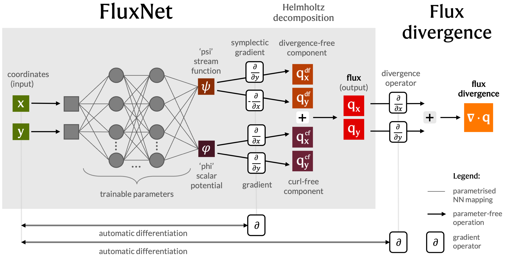
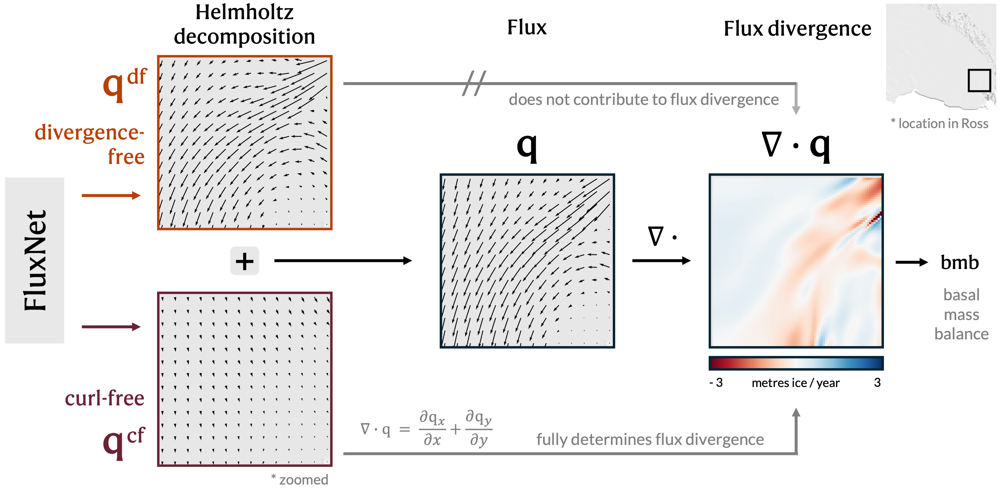
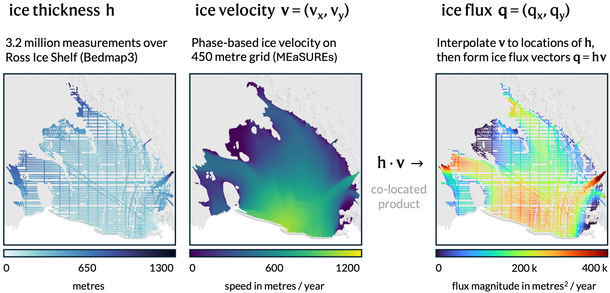

# FluxNet

Reproducible code for **Deep Learning Ice Shelf Basal Melt Rates via Differentiable Physics** submission to [Climate Informatics 2026](https://wp.unil.ch/ci26/).

We propose FluxNet, a physics-informed deep learning model that learns the mapping between location (x, y) and ice shelf flux (q = hv), so that the flux divergence field can be computed with automatic differentiation. Adjusted by prescribed surface mass balance (smb) and thickening fields (dh/dt), according to the mass balance equation, FluxNet generates continous geospatial basal mass balance (bmb) fields, i.e. basal melt estimates. 

  
FluxNet internally learns the Helmholz decomposition of the flux vector field, which can also be returned at inference. It thereby provides additional interpretable insights to modellers and domain experts.

  

# Files

## Pre-requisites
- [models.py](models.py) contains the proposed FluxNet model, the ResMLP baseline model, and the function to compute flux divergence.
- [regions.py](regions.py) contains the bounding box coordinates for the Ross Ice Shelf region. 
- [configs.py](configs.py) defines all experiment hyperparameters.

## Preprocessing
- [preprocess__bmb_benchmark.ipynb](preprocess__bmb_benchmark.ipynb) preprocesses, reprojects and visualises the bmb reference/benchmark map by Adusumilli et al. (2020).
- [preprocess__dhdt_thickening.ipynb](preprocess__dhdt_thickening.ipynb) preprocesses, reprojects and visualises the long-term dh/dt data product provided by Adusumilli et al. (2020).
- [preprocess__h_thickness.ipynb](preprocess__h_thickness.ipynb) proprocesses, cleans, and visualises all ice thickness measurements from the Bedmap3 source data collection for Ross Ice Shelf.
- [preprocess__smb_surface_mass_balance.ipynb](preprocess__smb_surface_mass_balance.ipynb) preprocesses, reprojects and visualises the surface mass balance (smb) estimates by Noël et al. (2023).
- [preprocess__target_grid_bedmap3.ipynb](preprocess__target_grid_bedmap3.ipynb) generates the target grid based on Bedmap3.
    - It outputs the target grid to [data/tighter_ice_shelf_mask.nc](data/tighter_ice_shelf_mask.nc).
- [preprocess__v_velocity.ipynb](preprocess__v_velocity.ipynb) preprocesses, reprojects and visualises the ice surface velocity data, i.e. MEaSUREs phase-based ice velocity map.
- [preprocess_generate_q_flux.ipynb](preprocess_generate_q_flux.ipynb) generates the full tensor of 3.2 million flux vector data points by interpolating the ice velocity field at the locations of the cleaned ice thickness observations, multiplying these, normalising x and y, and scaling the flux vectors to a more computationally friendly range. 
  - It outputs the full flux tensor to [data/flux_tensor.pt](data/flux_tensor.pt).
- [preprocess_split_q_train_test.ipynb](preprocess_split_q_train_test.ipynb) splits this tensor of q observations into train and test. 
    - It outputs the training tensor (~ 2.2M points) to [data/train_flux_tensor.pt](data/train_flux_tensor.pt).
    - It outputs the test tensor (~ 1M points) to [data/test_flux_tensor.pt](data/test_flux_tensor.pt).

## Exeriments, inference and interpretation
- [run_experiments_FluxNet.py](run_experiments_FluxNet.py) runs experiments with FluxNet.
    - saves trained model in [trained_models](trained_models).
    - saves convergence of training loss over epochs in [convergence](convergence).
    - saves results on train and test in [results](results).
- [run_experiments_ResMLP.py](run_experiments_ResMLP.py) runs experiments with ResMLP (Residual Multi-Layer Perceptron).
    - saves trained model in [trained_models](trained_models).
    - saves convergence of training loss over epochs in [convergence](convergence).
    - saves results on train and test in [results](results).
- [train_fluxnet_on_all_data.ipynb](train_fluxnet_on_all_data.ipynb) trains the FluxNet model on all available flux observations. 
    - Saves full FluxNet model to [fluxnet_trained_on_all_data](fluxnet_trained_on_all_data) folder.
- [helmholtz_decomposition.ipynb](helmholtz_decomposition.ipynb) showcases how FluxNet performs a Helmholtz decomposition, which is both interpretable (XAI) and a physics-informed representation (PIML).
    - It outputs component visualisations to [figures/helmholtz_decomposition](figures/helmholtz_decomposition).
- [visualise_results.ipynb](visualise_results.ipynb) explores the experimental results and visualises them in the form of of barcharts.
    - It outputs barcharts to [figures/barcharts](figures/helmholtz_barcharts).
- [assemble_bmb.ipynb](assemble_bmb.ipynb) assembles our bmb map from FluxNet divergence estimates and prescibed smb and dh/dt inputs, all stored in [data/fluxnet_div_ross.nc](data/fluxnet_div_ross.nc).

# Inputs

## Ice thickenss (h)

We use the Bedmap collection of ice thickness measurements. We combine all standardised .csv files from the Bedmap1, Bedmap2 and Bedmap3 collections from the [UK Polar Data Centre](https://www.bas.ac.uk/data/uk-pdc/). The lists of .csv files are visible on [this Bristish Antarctic Survey (BAS) webpage](https://www.bas.ac.uk/project/bedmap/#data).

Bedmap(3) references:
- *Pritchard, Hamish D., et al. "Bedmap3 updated ice bed, surface and thickness gridded datasets for Antarctica." Scientific data 12.1 (2025): 414.*
- *Frémand, Alice C., et al. "Antarctic Bedmap data: Findable, Accessible, Interoperable, and Reusable (FAIR) sharing of 60 years of ice bed, surface, and thickness data." Earth System Science Data 15.7 (2023): 2695-2710.*

## Ice velocity (v)

We use [MEaSUREs Phase-Based Antarctica Ice Velocity Map, Version 1](https://nsidc.org/data/nsidc-0754/versions/1)

Reference:
- *Mouginot, J., Rignot, E. & Scheuchl, B. (2019). MEaSUREs Phase-Based Antarctica Ice Velocity Map. (NSIDC-0754, Version 1). [Data Set]. Boulder, Colorado USA. NASA National Snow and Ice Data Center Distributed Active Archive Center. https://doi.org/10.5067/PZ3NJ5RXRH10. Date Accessed 10-02-2025.*

## Surface mass balance (smb)

We use interpolated [Higher Antarctic ice sheet accumulation and surface melt rates revealed at 2 km resolution](https://zenodo.org/records/10007855)
(filename: smb_rec.1979-2021.BN_RACMO2.3p2_ANT27_ERA5-3h.AIS.2km.YY.nc:)

Reference:
- *Noël, Brice, et al. "Higher Antarctic ice sheet accumulation and surface melt rates revealed at 2 km resolution." Nature communications 14.1 (2023): 7949.*

## Thickening rates (dh/dt)

We use ice shelf thickening rates provided by Adusumilli et al. (2020).

Reference:
- *Adusumilli, Susheel, et al. "Interannual variations in meltwater input to the Southern Ocean from Antarctic ice shelves." Nature geoscience 13.9 (2020): 616-620.* [Link to paper on Nature.](https://www.nature.com/articles/s41561-020-0616-z)
- [Link to UCSD data repository](https://library.ucsd.edu/dc/object/bb0448974g). Select Component 2 for ice shelf surface elevation changes.
- [Link to accompanying UCSD Scripps glaciology Github repository](https://github.com/sioglaciology/ice_shelf_change). Refer to *read_height_change_file.ipynb* notebook for preprocessing pipeline.

## Benchmark basal mass balance (bmb) map

We use Antarctic ices helf melt rates, provided Adusumilli et al. (2020), as a benchmark:
Average basal melt rates for Antarctic ice shelves for the 2010–2018 period at high spatial resolution, estimated using CryoSat-2 data. This data file was last updated on 2020-06-11.

Reference:
- *Adusumilli, Susheel, et al. "Interannual variations in meltwater input to the Southern Ocean from Antarctic ice shelves." Nature geoscience 13.9 (2020): 616-620.* [Link to paper on Nature.](https://www.nature.com/articles/s41561-020-0616-z)
- [Link to UCSD data repository](https://library.ucsd.edu/dc/object/bb0448974g). Select Component 3 for Antarctic ice shelf melt rates.
    - **Antarctic ice shelf melt rates**: Average basal melt rates for Antarctic ice shelves for the 2010–2018 period at high spatial resolution, estimated using CryoSat-2 data. This data file was last updated on 2020-06-11.
    - Description: Average basal melt rates for Antarctic ice shelves for the 2010–2018 period at high spatial resolution, estimated using CryoSat-2 data. Interpolated values in regions with missing data are provided as a separate field. We are currently working on using ICESat-2 data to improve the estimates over regions with missing CryoSat-2 data.
- [Link to accompanying UCSD Scripps glaciology Github repository](https://github.com/sioglaciology/ice_shelf_change). Refer to *ead_melt_rate_file.ipynb* notebook for the dataset loading pipeline.
